# Semo Template

A personal front-end practice project to learn and apply responsive HTML & CSS techniques.  
Part of my long-term journey to become a Full Stack Developer.

---

## 🔍 Overview

This project showcases a structured one-page layout featuring multiple sections such as:

- Header Navigation
- Landing Page
- Articles
- Gallery
- Features
- Testimonials
- Team Members
- Services
- Our Skills
- How It Works?
- Latest Events
- Pricing Plans
- Top Videos
- Stats
- Request A Discount
- Footer

---

## 💡 Skills Practiced

- Semantic HTML5
- CSS3 Styling & Variables
- Responsive Design using Media Queries
- Flexbox Layout Techniques
- Google Fonts Integration
- Font Awesome Icons
- Normalize.css for Cross-Browser Consistency
- Using Git for version control
- Deploying via GitHub Pages

---

## 🖼 Screenshots

> Here's a visual preview of the key sections in the template:

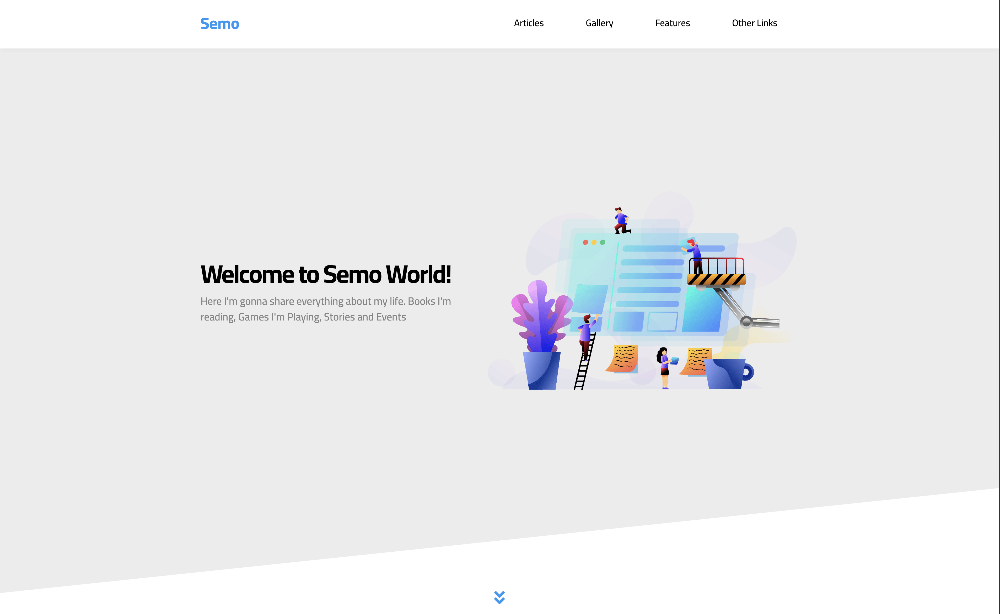
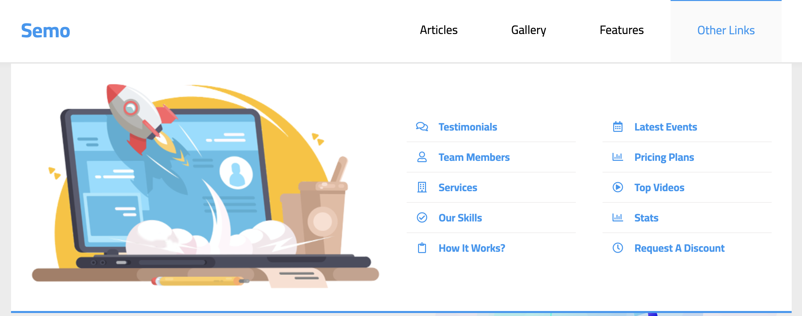
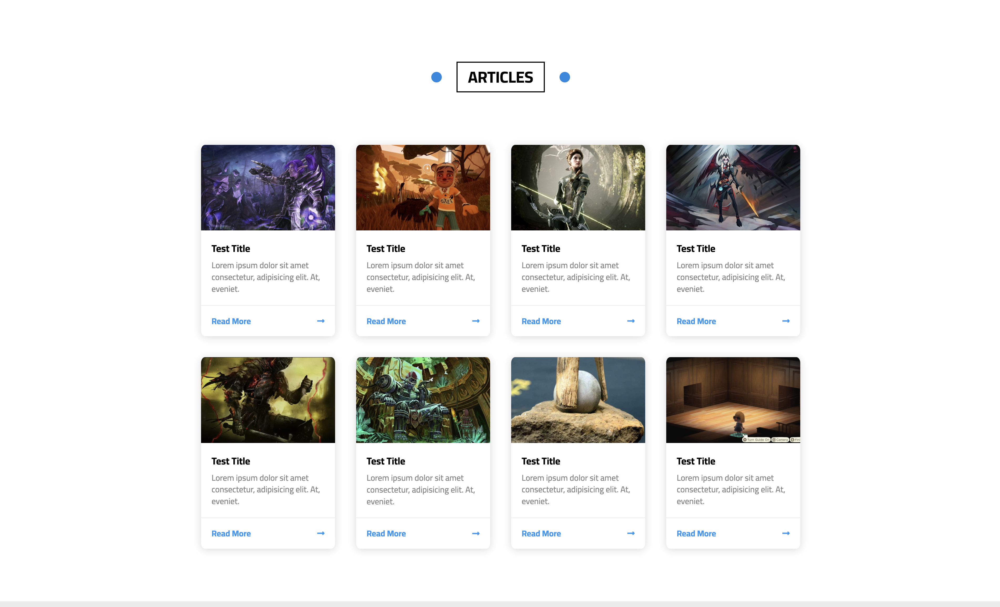
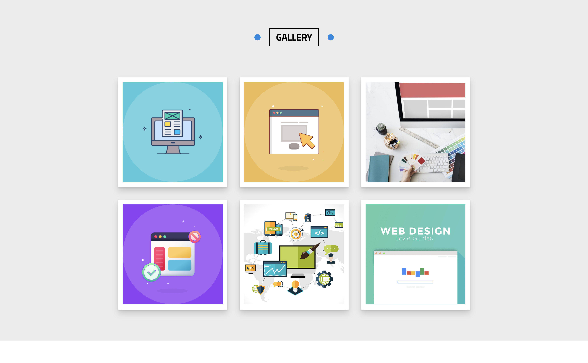
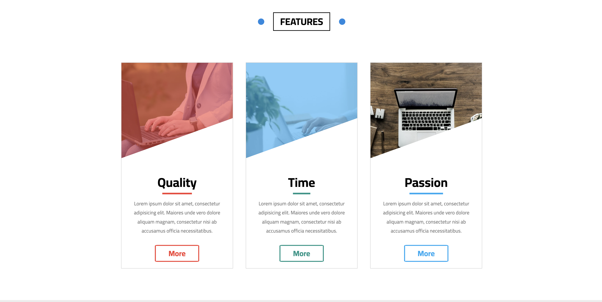
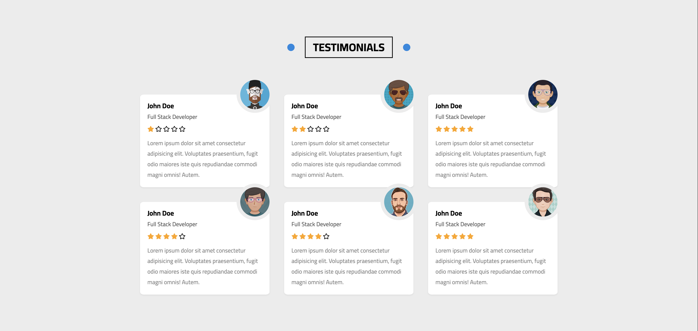
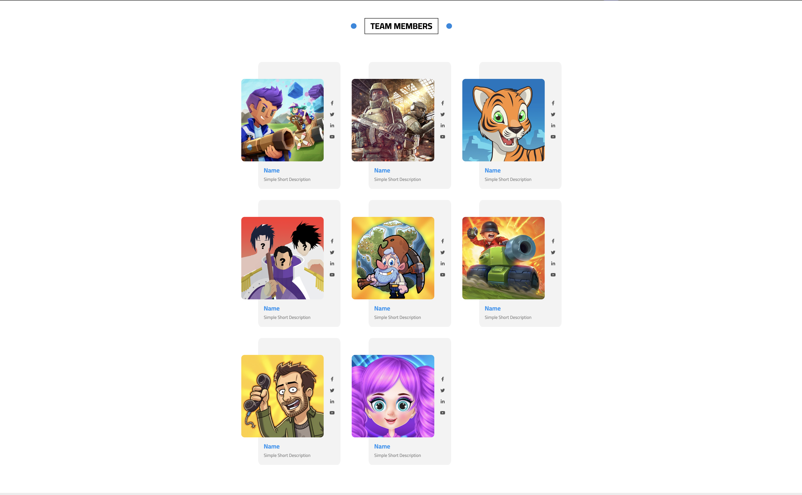
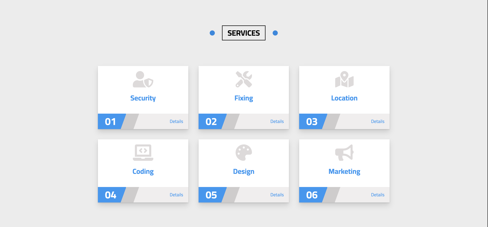
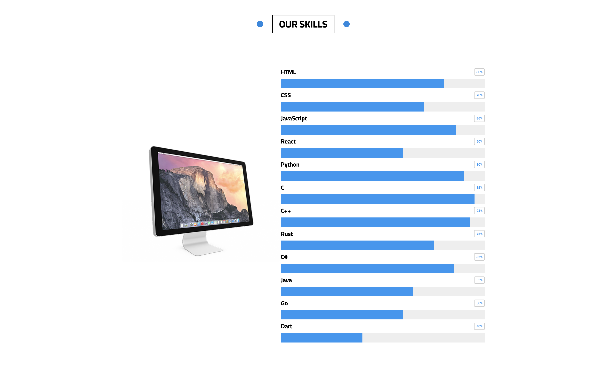
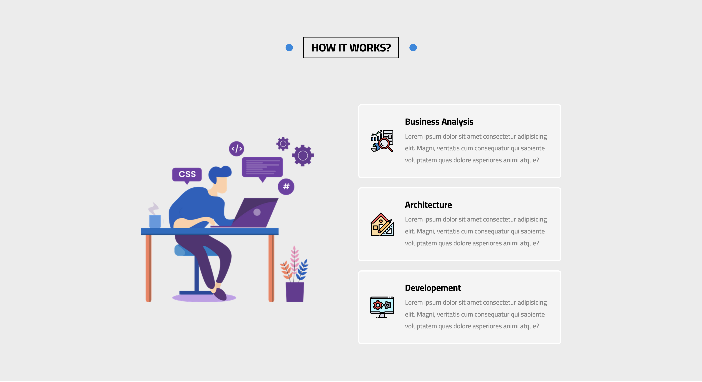
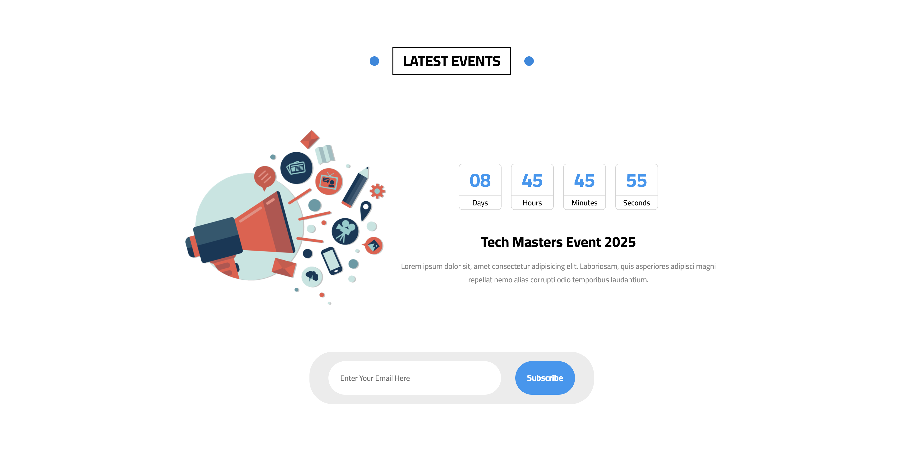
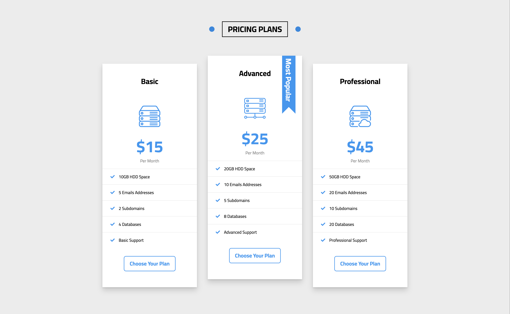

---

## 🌐 Live Preview

You can view the project online at:  
👉 [Click to open GitHub Pages](https://eslam-al-dabawi.github.io/semo-tamplate/)

---

## 🚀 How to Run

1. Download or clone the repository
2. Open `index.html` in your browser
3. No dependencies or build tools required

---

## 📚 Learning Goals

This project is part of my personal learning roadmap. I'm currently focusing on:

- Mastering layout systems (Flexbox and CSS Grid)
- Writing clean, scalable, and maintainable CSS
- Building fully responsive UIs
- Preparing to integrate JavaScript in upcoming projects
- Step-by-step progress toward Full Stack Web Development

> This template is part of a bigger journey to become a confident full stack developer.

---

## 🙌 Credits

All images and icons used are for educational purposes only.
